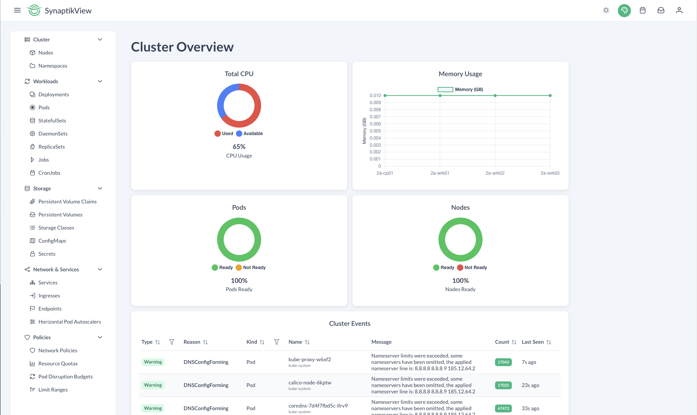

# SynaptikView - Modern Kubernetes Dashboard

<div align="center">
  
  <p>A lightweight, modern dashboard for Kubernetes cluster management</p>
</div>

## Overview

SynaptikView is a responsive web application that provides a clean, intuitive interface for Kubernetes cluster management. It offers real-time monitoring, resource visualization, and management capabilities designed to simplify operations for both beginners and experienced Kubernetes administrators.

### Key Features

- **Cluster Overview Dashboard**: Real-time metrics with visual charts for CPU, memory, pods, and nodes
- **Event Monitoring**: Centralized event tracking across all namespaces
- **Resource Management**: Full CRUD operations for various Kubernetes resources:
  - **Workloads**: Deployments, StatefulSets, DaemonSets, ReplicaSets, Jobs, CronJobs, and Pods
  - **Network & Services**: Services, Ingresses, Endpoints, and Network Policies
  - **Storage**: PersistentVolumes, PersistentVolumeClaims, StorageClasses, ConfigMaps, and Secrets
  - **Policies**: Resource Quotas, LimitRanges, and Pod Disruption Budgets
- **Multi-Namespace Support**: View and filter resources across all namespaces or zoom in on specific ones
- **Modern UI/UX**: Responsive interface with dark mode support

## Technology Stack

- **Frontend**: Vue.js 3 (Composition API), PrimeVue components
- **Backend**: Node.js with Express
- **Kubernetes Integration**: Official Kubernetes JavaScript client
- **Visualization**: Chart.js for metrics and resource visualization

## Prerequisites

- Node.js 14+
- A running Kubernetes cluster (local or remote)
- `kubectl` configured with cluster access

## Installation

```bash
# Clone the repository
git clone https://github.com/wrkode/sinaptikview.git
cd sinaptikview

# Install dependencies
npm install

# Start the development server
npm run dev
```

The application runs on `http://localhost:3000` by default, with the backend API on `http://localhost:3001`.

## Configuration

SynaptikView automatically uses your Kubernetes configuration from `~/.kube/config`. You can override this by setting the `KUBECONFIG` environment variable:

```bash
export KUBECONFIG=/path/to/custom/kubeconfig
```

## Usage

1. **Cluster Dashboard**: Navigate to the dashboard to see the overview of cluster resources
2. **Resource Navigation**: Use the sidebar menu to navigate between different resource types
3. **Namespace Selection**: Select a specific namespace or "All Namespaces" from the dropdown
4. **Resource Details**: Click on any resource to view its detailed information and status
5. **Events**: Browse through events to troubleshoot issues or monitor cluster activities

## Development

```bash
# Run frontend and backend in development mode
npm run dev

# Run just the frontend
npm run dev:frontend

# Run just the backend
npm run dev:backend

# Build for production
npm run build
```

## Project Structure

```
sinaptikview/
├── public/           # Static assets
├── server/           # Backend server code
│   └── server.js     # Express API server
├── src/              # Frontend source code
│   ├── components/   # Reusable Vue components
│   ├── layout/       # Layout components (sidebar, topbar)
│   ├── router/       # Vue Router configuration
│   ├── views/        # Page components
│   │   ├── workloads/    # Workload-related views
│   │   ├── network/      # Network-related views
│   │   ├── storage/      # Storage-related views
│   │   └── policies/     # Policy-related views
│   ├── App.vue       # Root component
│   └── main.js       # Application entry point
└── package.json      # Dependencies and scripts
```

## Contributing

Contributions are welcome! Please feel free to submit a Pull Request.

1. Fork the project
2. Create your feature branch (`git checkout -b feature/amazing-feature`)
3. Commit your changes (`git commit -m 'Add some amazing feature'`)
4. Push to the branch (`git push origin feature/amazing-feature`)
5. Open a Pull Request

## License

This project is licensed under the Apache License 2.0 - see the [LICENSE](LICENSE) file for details.

## Acknowledgments

- Built with [Vue.js](https://vuejs.org/) and [PrimeVue](https://primefaces.org/primevue/)
- Kubernetes client provided by [kubernetes-client/javascript](https://github.com/kubernetes-client/javascript)
- Charts powered by [Chart.js](https://www.chartjs.org/)

---

<div align="center">
  <p>Made with ❤️ by <a href="https://github.com/wrkode">wrkode</a></p>
</div>
